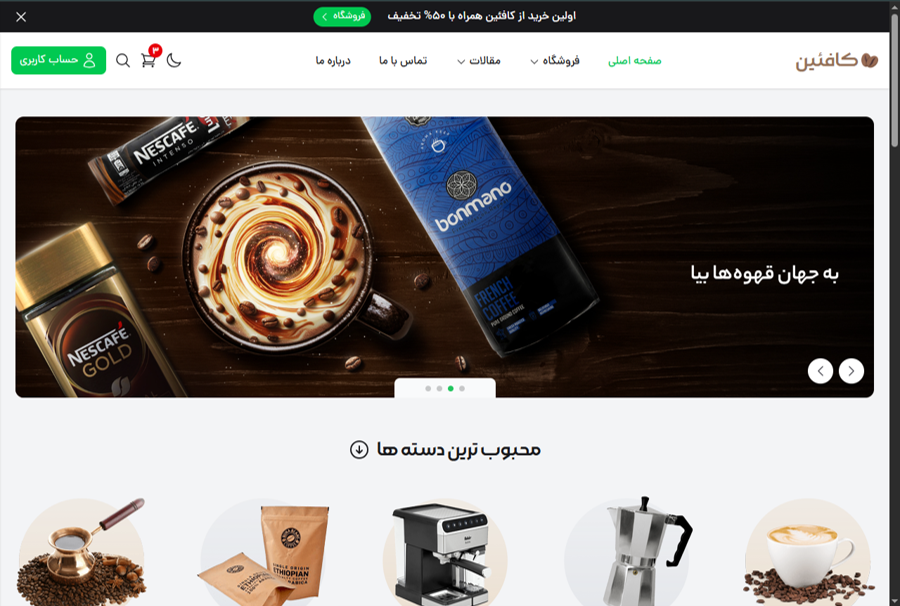

# caffeine (Tailwindcss) [Live Demo](https://caffeine-tailwindcss.netlify.app/pages/)

> This is coffeeshop website that built by tailwindcss and swiper js libraries for just educational purposes.

### features:
- Responsive layout for all devices
- Swiper js for sliders
- light & dark mode with capablitiy localstorage
- Multi pages like shop & article pages
- Countdown timer for discount
- Mobile menu and responsive shopping cart

